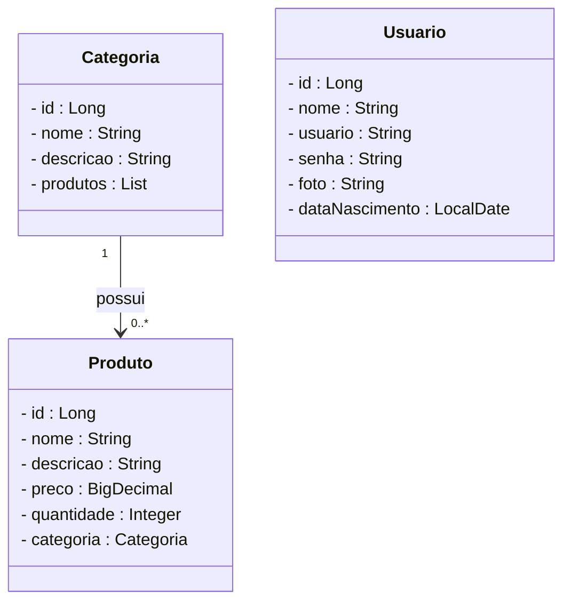

# 🏥 Projeto E-commerce de Farmácia - Backend com Spring Boot

<br />

<div align="center">
    
    
    
    
    
    
    
</div>

<br />

## 1. Descrição

O projeto **E-commerce de Farmácia** é uma API REST desenvolvida em Java com Spring Boot, que permite o gerenciamento de **Produtos**, **Categorias** e **Usuários**. O objetivo é possibilitar a criação, leitura, atualização e remoção desses dados, além de testar e praticar conceitos de desenvolvimento de APIs RESTful.

## 2. Funcionalidades

- ✅ CRUD completo de **Categorias**
- ✅ CRUD completo de **Produtos** com relacionamento Many-to-One com Categoria
- ✅ CRUD completo de **Usuários** com verificação de maioridade (sem security)
- ✅ Filtros de produtos por nome e por preço
- ✅ Validações com Jakarta Validation
- 🚧 Segurança (Security + JWT) em desenvolvimento (etapa futura)

## 3. Organograma do Projeto

```plaintext
farmacia
│
├── controller
│   ├── CategoriaController.java
│   ├── ProdutoController.java
│   └── UsuarioController.java
│
├── model
│   ├── Categoria.java
│   ├── Produto.java
│   └── Usuario.java
│
├── repository
│   ├── CategoriaRepository.java
│   ├── ProdutoRepository.java
│   └── UsuarioRepository.java
│
├── service
│   └── UsuarioService.java
│
└── FarmaciaApplication.java
```

## 4. Diagrama de Classes



## 5. Tecnologias utilizadas

| Item                          | Descrição       |
| ----------------------------- | --------------- |
| **Servidor**                  | Tomcat          |
| **Linguagem de programação**  | Java            |
| **Framework**                 | Spring Boot     |
| **ORM**                       | JPA + Hibernate |
| **Banco de dados Relacional** | MySQL           |
| **Documentação**              | SpringDoc OpenAPI (planejado) |
| **Testes de API**             | Insomnia ou Postman |

## 6. Endpoints disponíveis

### 🔸 Categoria
- `GET /categorias`
- `GET /categorias/{id}`
- `GET /categorias/nome/{nome}`
- `POST /categorias`
- `PUT /categorias`
- `DELETE /categorias/{id}`

### 🔸 Produto
- `GET /produtos`
- `GET /produtos/{id}`
- `GET /produtos/nome/{nome}`
- `GET /produtos/preco-maior/{preco}`
- `GET /produtos/preco-menor/{preco}`
- `POST /produtos`
- `PUT /produtos`
- `DELETE /produtos/{id}`

### 🔸 Usuário
- `POST /usuarios/cadastrar`
- `PUT /usuarios/atualizar`
- `GET /usuarios/all`
- `GET /usuarios/{id}`

## 7. Como Executar o projeto

1. Clone o repositório:

```bash
git clone https://github.com/feperonica/projeto_final_bloco_02.git
```

2. Abra na sua IDE (STS, IntelliJ, Eclipse)
3. Configure o arquivo `application.properties` com seus dados de banco
4. Execute a classe `FarmaciaApplication`
5. Teste os endpoints via Insomnia ou Postman

## 8. Contato

Desenvolvido por [**Felipe Peronica**](https://github.com/feperonica)  
📧 felipeperonica@gmail.com
