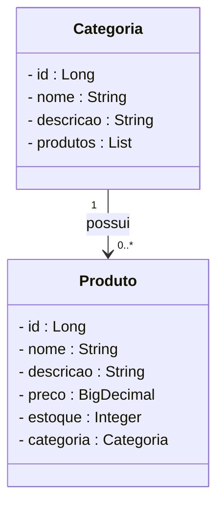

# 🏥 Projeto E-commerce de Farmácia - Backend com Spring Boot

<br />

<div align="center">
    
    
    
    
    
    
    
</div>

<br />

## 1. Descrição

O projeto **E-commerce de Farmácia** é uma API REST desenvolvida em Java com Spring Boot, que permite o gerenciamento de produtos e categorias de uma farmácia. O objetivo é possibilitar a criação, leitura, atualização e remoção de produtos e categorias, além de testar e praticar conceitos de desenvolvimento de APIs RESTful.

## 2. Sobre esta API

A API foi desenvolvida utilizando **Java** e o **framework Spring**, seguindo os princípios da Arquitetura MVC e REST. Ela oferece endpoints para o gerenciamento dos recursos **Categoria** e **Produto**, que estão relacionados entre si.

### 2.1. Funcionalidades:

1. CRUD completo de Categorias
2. CRUD completo de Produtos
3. Relacionamento entre Produtos e Categorias (One to Many)
4. Busca por nome de Produto e Categoria
5. Validações e tratamento de erros


## 3. Diagrama de Classes



## 4. Tecnologias utilizadas

| Item                          | Descrição       |
| ----------------------------- | --------------- |
| **Linguagem de programação**  | Java            |
| **Framework**                 | Spring Boot     |
| **ORM**                       | JPA + Hibernate |
| **Banco de dados Relacional** | MySQL           |
| **Documentação**              | SpringDoc OpenAPI |
| **Testes de API**             | Insomnia ou Postman |

## 5. Requisitos

- Java JDK 17+
- Banco de dados MySQL
- STS ou IntelliJ IDEA
- Insomnia ou Postman

## 6. Como Executar o projeto

1. Clone o repositório:

```bash
git clone https://github.com/feperonica/projeto_final_bloco_02.git
```

2. Abra na sua IDE
3. Configure o arquivo `application.properties` com seus dados de banco
4. Execute a classe `farmaciaApplication`
5. Teste os endpoints via Insomnia ou Postman

## 8. Contato

Desenvolvido por [**Felipe Peronica**](https://github.com/feperonica)  
📧 felipeperonica@gmail.com
